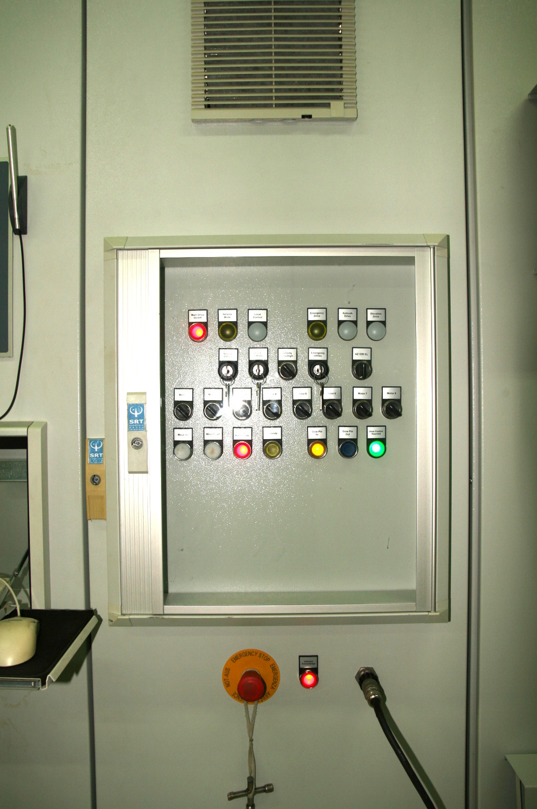
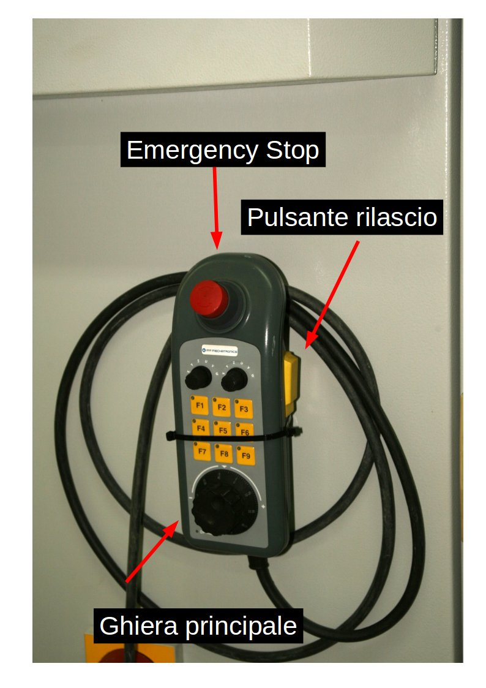
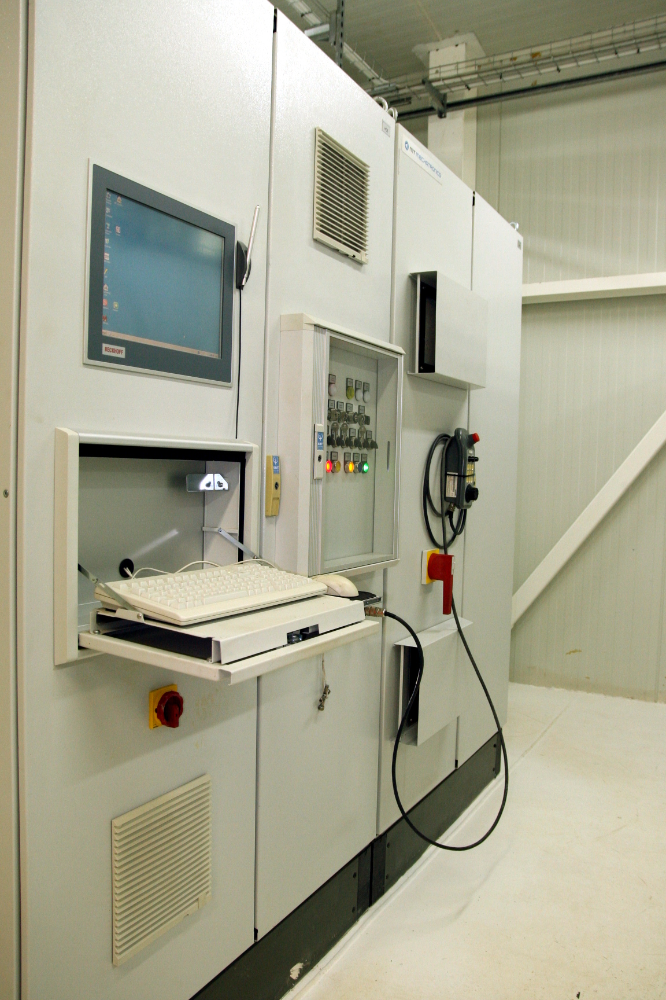

.. _antenna:

===========================================
Procedure Servo sistemi  Maggiori (Antenna)
===========================================

.. _acu_description:

Operazioni in Alidade Equipment Room
------------------------------------

Per eseguire le procedure qui sotto descritte è necessario recarsi
nell' Alidade Equipment Room (ALER), dove  si trovano le seguenti risorse:

* Local Control Panel o LCP 
* Emergency Control Panel, cabinet +C1 
* Portable Control Unit PCU

In BOX CR è collocato il Portable Control Panel (PCP)

   

   
   ECP emergency control panel 

   PCU: Portable Control Panel

Local Control Panel
-------------------

L'antenna può essere movimentata tramite il local control panel. 
Fisicamente si trova nella stanza alidade equipment room (ALER). 
Nella figura sottostante, il LCP e' nel rack di sinistra.

Per operare tramite l'LCP occorre: 

- effettuare login. Se la schermata è bloccata, vengono richieste credenziali. 
- se il pannello LCP non e' avviato, comparirà il desktop window xp, in tal caso avviarlo cliccando su ``srt_lcp_mt42.exe``

  
   Local Control Panel

   Local Control Panel e Emercency Control Panel

.. figure::images/LCP.png
   :scale: 100 %
   :alt: local control panel
   :align: center

   LOCAL CONTROL PANEL (LCP)

.. _acu_local:

ACU: controllo locale 
---------------------

- Identificare l'interruttore a chiave ``remote/locale`` e la lampadina *local control*
  nel *control panel* nel pannello *+C1*
  
Per operare in modalità ``locale`` è necessario:

- aprire la finestra di plexiglas del pannello di controllo (dotarsi di apposita chiave);
- girare la chiave dell'interruttore ``remote/locale`` nella posizione ``locale``

Quando la modalità ``locale`` è attivata la lampadina *local control* è accesa. 

.. _acu_remote:

ACU: controllo remoto 
---------------------

- Identificare l'interruttore a chiave ``remote/locale`` e la lampadina *local control*
  nel *control panel* nel pannello *+C1*

- aprire la finestra di plexiglas del pannello di controllo (dotarsi di apposita chiave);
- girare la chiave dell'interruttore ``remote/locale`` nella posizione ``remote``

Quando la modalità ``remote`` è attivata, il led *local control* è spenta. 

.. _stow_LCP:

Antenna in stow tramite ACU
---------------------------

- Recarsi in stanza ALER
- attivare :ref:`locale <acu_local>` ACU 
- cliccare su pulsante attivare ``activate`` lato di destra per attivare i motori in elevazione
- selezionare stow menu;
- selezionare opzione ``drive to stow``

..  _override:

OVERRIDE EMERGENCY STOP
-----------------------

.. important::

    La procedura permette di bypassare gli emergency stop di bassa priorità.
    Sono ad alta priorità gli emercency stop del PCU e del cabinet +C1 e non
    possono essere bypassati da questa procedura. Tutti gli altri emergency
    stop sono a bassa priorità. 

    La sicurezza durante l'operazione è garantita da un dispositivo vigilante. 

 
- prendere dalla control room la chiave per aprire il pannello del quadro +C1
- Recarsi in stanza ALER
- attivare modalità      ``service`` 
  impostando ``on``  nell'interruttore a chiave ``Service`` 
- attivare modalità ``override`` premendo il pulsante ``override`` nel pannello del quadro +C1.
  il led giallo acceso indica che la modalità *override* è attiva
- abilitare il PCU mettendo il selettore di sinistra   su Y (nel caso si voglia muovere in azimuth) 
    o Z (per l 'elevazione)
- impostare il selettore del PCU su U (override) quello di destra.

A questo punto il sistema è pronto per la procedura di *override*. Se non viene premuto il 
pulsante di rilascio, posto  lateralmente nel PCU, i led F1,F4,F7,F3,F6,F9 sono accesi. Le seguenti azioni devono
essere eseguite tramite il PCU,  mantenendo premuto il pulsante di rilascio, a metà pressione. 

.. important:: il pulsante di rilascio consente 3 livelli di pressione: nessuna pressione, pressione intermedia, 
   pressione completa.   La pressione completa e nessuna pressione hanno lo stesso effetto, ovvero
   quello di un interruttore aperto. La pressione dell' interrutture deve essere intermedia per
   essere efficace

Per continuare la procedura occorre:

- premere il pulsante F1 per il  riconoscimento dell' emergency stop (ACK) 
- premere il pulsante F2 se è necessario riconscere un *fault* (led "FAULT" acceso nel ECP)
- premere il pulsante F3 per abilitare l'asse selezionato. 
- premere il pulsante F4 per attivare lo slewing
- ruotare la ghiera principale per avviare il movimento lungo l'asse selezionato.

.. _ECU_stow:

STOW dell'antenna in modalità ECU 
---------------------------------

**Operatori richiesti in antenna**: 2 

Precondizioni: Posizione in elevazione al di sotto della posizione di STOW

Nella movimentazione dell'antenna tramite la ECU non si hanno informazioni dell'effettiva posizione
del telescopio, pertanto è necessario un controllo visivo di un operatore in modo da evitare
di raggiungere i limit switch.
 

Movimentazione in STOW tramite ECU
----------------------------------

**Operatori richiesti in antenna**: 2 

Nella movimentazione dell'antenna tramite la ECU non si hanno informazioni dell'effettiva posizione
del telescopio, pertanto **è necessario un controllo visivo da parte di un secondo operatore in modo da evitare
di raggiungere i limit switch**. Il secondo operatore dovrà essere in prossimità di un emergency stop.

Questa è una procedura di emergenza, e  deve essere utilizzata unicamente in caso di malfunzionamento dell' ACU, ovvero 
se l'antenna non puo' essere messa in *stow* con le procedure normali, che sono:

1. stow mediante software di controllo NURAGHE dalla control room;
2. pulsante verde in control room per l'auto stow;
3. stow mediante LCP, ovvero con ACU in  controllo locale;

**Solo l'asse di elevazione deve essere movimentato per garantire la messa in sicurezza dell'antenna in posizione di stow**

Procedura:

- Attivare ECU:

  - Software di controllo ACU deve essere spento. Premere pulsante ``main drive`` affinché sia  off
  -  Verificare che il led ``Main drive ON/OFF`` sia spento;

  - ACU deve essere spenta ed effetuato shutdown. **NB se è necessaria la procedura di stow mediante ECU, significa che  ACU e' non funzionante e pertanto si trova nella condizione come se fosse di shutdown**
  -  impostare interruttore a chiave ``local control`` su ``on``
  -  verificare che il led ``local control`` sia acceso
  -  impostare interruttore a chiave ``emergency control`` su  ``on``
  -  verificare che il led ``emergency drive`` sia acceso
  -  il pulsante ``main drive on`` deve essere premuto di nuovo per commutare sull' ECU.
  -  verificare che il led ``Main drive ON/OFF`` sia acceso;
  -  Tutti gli eventuali errori o interlocks devono essere resettati premendo i pulsanti ``fault-acknowledge`` o ``interlock-acknowledge``   
 
- selezionare asse "Elevation" tramite interruttore ``axis drive selector switch``
- verificare che il led dell'asse selezionato sia acceso
- selezionare motori (non selezionare il motore non funzionante)
- selezionare la velocità desiderata traminte l'interruttore ``Velocity low/high``
- individuare i pulsanti ``Move up/down`` per la movimentazione dell'antenna nell'ECP  
- muovere l'antenna in elevazione a velocità positiva (elevazione crescente).
- interrompere il movimento quando il led verde "stow position reached" si accende. 
- se si supera la posizione di *stow*, il led verde si spegne e pertanto è necessario:
- interrompere il movimento;
- muovere l'antenna in elevazione a velocità negativa fino a raggiungere la posizione di stow
- asscurarsi che effettivamente la posizione di stow sia stata raggiunta tramite ispezione visiva.
- movimentare lo *stow pin* mediante apposito pulstante del ECP
- attendere circa un minuto e 20 secondi finché lo *stow pin* e' completamente inserito ed il rispettivo
  led e' illuminato (stow pin in/antenna stowed)

   
Interruttori di velocità ``low\high``
~~~~~~~~~~~~~~~~~~~~~~~~~~~~~~~~~~~~~

Impostano la velocità per la movimentazione tramite ECP.

- alta velocità

    - azimuth 0.085 deg/s
    - elevazione 0.05 deg/s

- bassa velocità: 
    - azimuth 0.0085 deg/s
    - elevazione 0.005 deg/s

Selezione Motori 
~~~~~~~~~~~~~~~~

L'ECU può essere utilizzato con un numero qualsiasi di motori disponibili. Se un motore non e' disponibile
in quanto guasto, non selezionarlo
