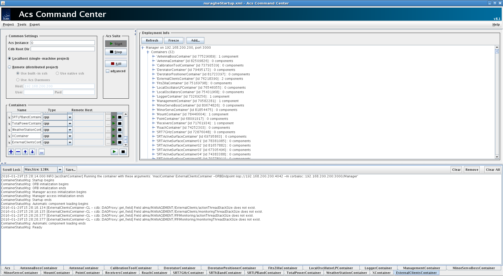
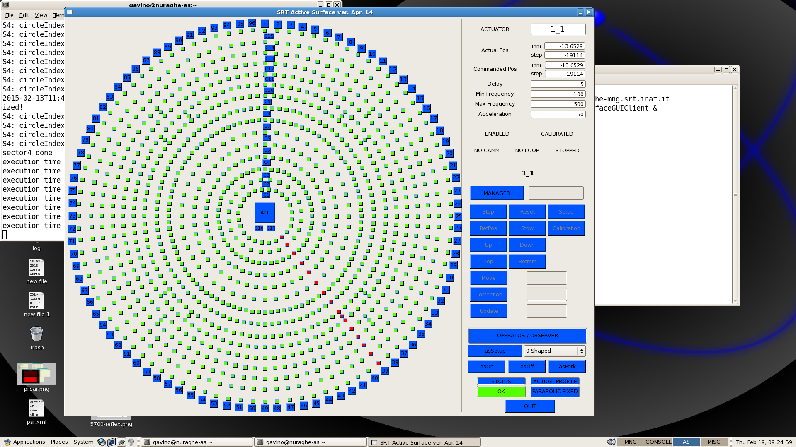

.. _nuraghe-is-ready:

*********************************
Verificare che Nuraghe sia attivo
*********************************
.. index:: single: NURAGHE - Controllo se attivo

- Sulla console nuraghe-mng, selezionare il desktop virtuale MNG
- Individuare il pannello **ACS Command Center**
 

- verificare che nel riquadro **deployment info**  siano indicati **32** Container attivi:  

  #. AntennaBossContainer
  #. AntennaContainer
  #. CalibrationToolContainer
  #. DerotatorsContainer
  #. DerotatorPositionerContainer
  #. ExternalClientsContainer
  #. FitsZillaContainer
  #. LocalOscillatorsContainer
  #. LocalOscillatorsLPContainer
  #. LoggerContainer
  #. ManagementContainer
  #. MinorBossContainer
  #. MinorServoContainer
  #. MountContainer
  #. PointContainer
  #. ReceiversContainer
  #. RoachContainer
  #. SRT7GHzContainer
  #. SRTACtiveSurfaceContainer
  #. SRTACtiveSurfaceContainer01
  #. SRTACtiveSurfaceContainer02
  #. SRTACtiveSurfaceContainer03
  #. SRTACtiveSurfaceContainer04
  #. SRTACtiveSurfaceContainer05
  #. SRTACtiveSurfaceContainer06
  #. SRTACtiveSurfaceContainer07
  #. SRTACtiveSurfaceContainer08
  #. SRTKBandContainer
  #. SRTLPBandContainer
  #. TotalPowerContainer
  #. WeatherStationContainer
  #. XContainer

- selezionare il desktop virtuale AS
- identificare il pannello grafico relativo alla superficie attiva
- il numero delle linee non funzionanti della superficie attiva (attuatori marcati rossi) deve esse trascurabile rispetto al totale:
 

   Pannello Superficie Attiva

