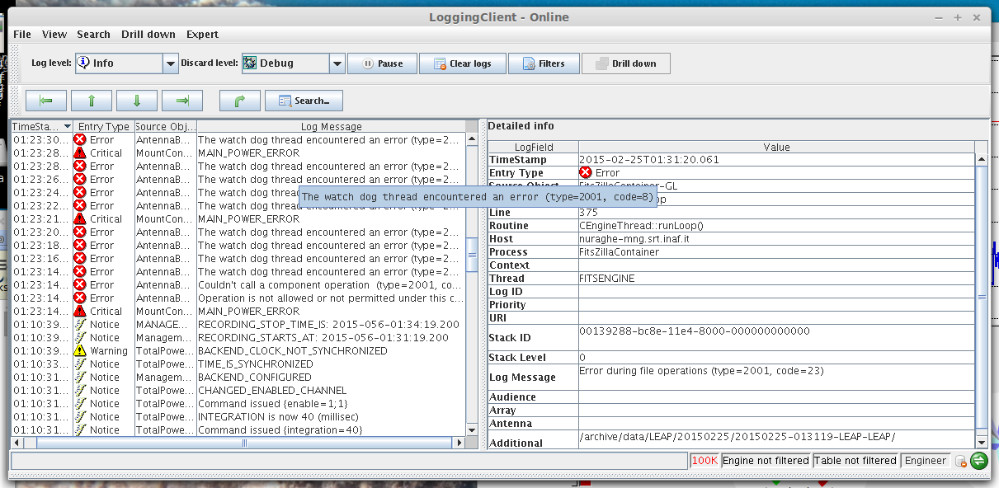
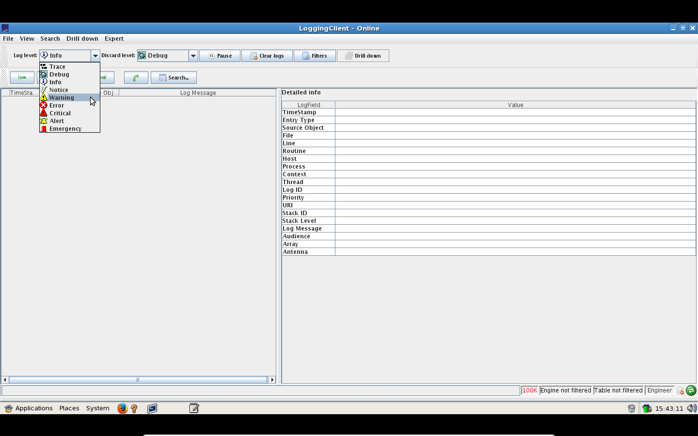

.. _jlog:

jlog
-------------------------------

Client grafico dei log di ACS.
Da una shell di ``nuraghe-mng`` o di ``nuraghe-obs1`` eseguire il comando::

$> jlog &

   
   jlog

Permette di tenere sotto controllo il flusso delle informazioni di log di *NURAGHE* indicando la severità.

Jlog permette di filtrare i messaggi evidenziando solo quelli di priorità più alta,
cliccando su ``log level`` e dal menù a tendina selezionare ``Warning``. In questo modo verranno mostrati i messaggi cruciali.

   

