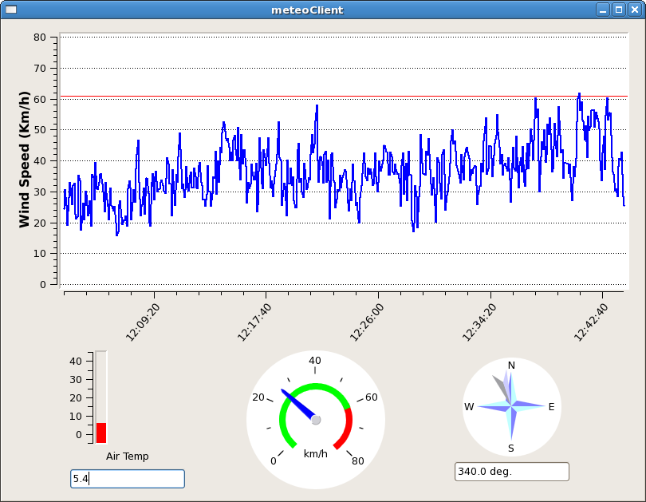

Pannello parametri meteo
-------------------------

Da una shell di nuraghe-mng eseguire il comando::

$> meteoClient &

Verrà aperto un pannello per con le informazioni su temperatura dell'aria, pressione atmosferica e direzione del vento. Nonché il 
grafico della velocità del vento degli ultimi 30 minuti.

   Parametri Meteo. Nel pannello relativo al vento, la linea rossa orrizontale rappresenta la velocità oltre la quale occore
   mettere l'antenna in ``stow``

