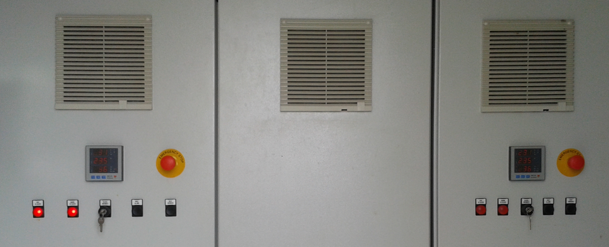
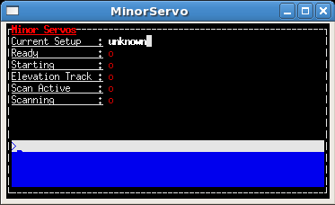
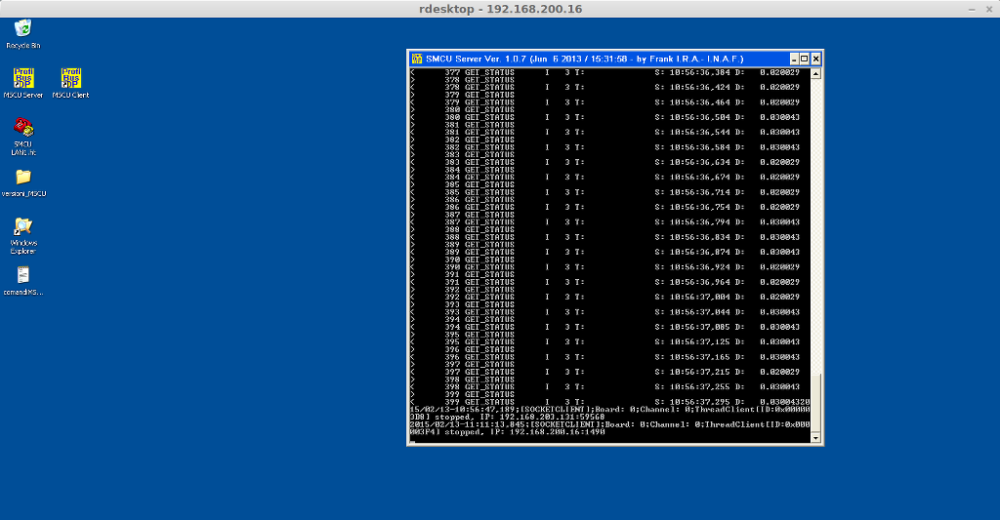
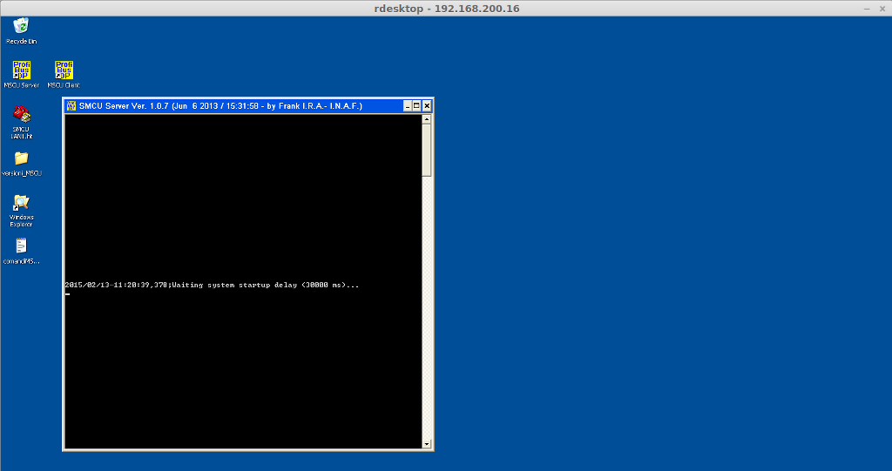
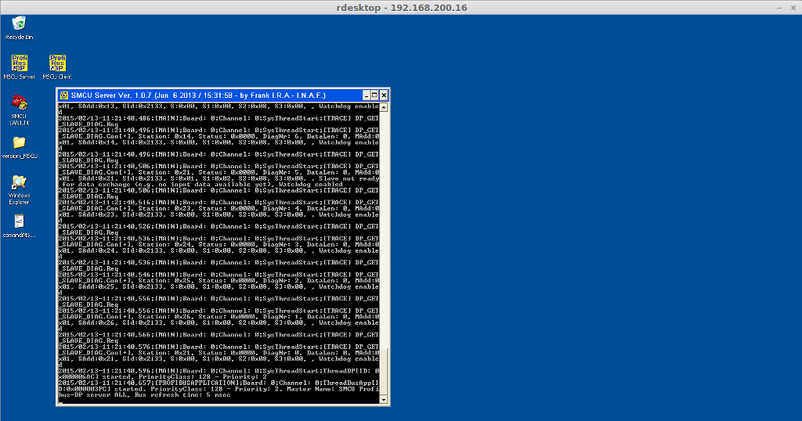

************
Servo Minori
************

.. sectionauthor:: :ref:`mbuttu`, Gian Paolo Vargiu

.. _ms-emergency-stop:

Fare il reset degli emergency stop
==================================
Dopo aver premuto un emergency stop nel circuito dei servo minori,
per rendere i servo sistemi operativi non è sufficiente rilasciare il pulsante
premuto, ma è necessario fare il reset dell emergenze. Il reset va fatto
premendo il pulsante **RESET EMERGENZE** esternamente al quadro elettrico 
del servo in questione. 

.. note:: Il LED del pulsante **QUADRO IN BLOCCO** è acceso fisso (non
   lampeggia) quando vi è un *emergency stop* premuto. E' acceso e
   lampeggiante quando l'emergency stop è stato rilasciato ma non è stato 
   fatto il reset delle emergenze. E' spento quando il servo è 
   pronto per essere utilizzato.

Le seguenti due sezioni spiegano in dettaglio come effettuare il reset.

Reset del GFR o del M3R
-----------------------
Per fare il reset degli emergency stop relativi al Gregorian
Feed Rotator (GFR) e al M3 Rotator (M3R), si prema il pulsante
**RESET EMERGENZE** nel fronte quadro dei servo (quando si entra in EER
dal lato ascensore, il quadro lo si trova a sinistra della porta). Di seguito
una foto del quadro in questione.

.. figure:: images/m3r_gfr_drive_cabinet.png
   :scale: 100%
   :alt: M3R GRF drive cabinet
   :align: center

   Figura: Fronte quadro del Gregorian Feed Rotator e M3 Rotator

Reset del PFP o del SRP
-----------------------
Per fare il reset degli emergency stop relativi al Primary Focus
Positioner (PFP) e al SubReflector Positioner (SRP), si prema il pulsante
**RESET EMERGENZE** nel fronte quadro di entrambi i servo. I quadri sono
situati in APEX room.

   Figura: Quadri elettrici del PFP e SRP

.. _ms_setup:

Fare il setup dei soli servo minori
===================================

.. TODO:: Sezione da completare

Eseguire da *OperatoInput* il comando ``servoSetup=XXX``. 
Ad esempio, se si vuole mettere in fuoco il ricevitore in banda C::

    > servoSetup=CCB

Nella console dei servo minori il flag ``starting`` dovrebbe diventare
verde, come mostrato in figura.

.. note:: Inserire immagine console servo con flag starting verde

Il setup termina quando il flat ``starting`` passa da verde a rosso (sono
necessari dai 2 ai 4 minuti, a seconda del setup). Se il setup è
andato a buon fine, nella console dei servo minori il campo 
``actualSetup`` riporta il codice del setup appena effettuato, e il flag
``ready`` diventa verde. Ad esempio, in figura X è mostrata la console
dei servo minori dopo che è stato concluso con successo un ``servoSetup=CCB``.

.. note:: Inserire immagine console servo con servoSetup=CCB done

Se il flag ``starting`` è diventato rosso ma il flag ``ready`` non
è diventato verde, come indicato nella figura seguente, allora c'é stato 
un problema con il setup.

   Figura: La console dei servo minori indica che il sistema non è configurato

In questo caso si consulti la sezione :ref:`ms-setup-problem`.

.. _mscu-restart:

Riavviare la MSCU
=================
La Minor Servo Control Unit (MSCU) è il server di controllo di tutti i 
servo minori. E' un PC embedded situato all'interno del quadro elettrico
di M3R e GFR. Prima di riavviare la MSCU, si vada su *nuraghe-mng* e
nell'*acsCommandCenter* si chiudano i container ``MinorServoBossContainer`` 
e ``MinorServoContainer``. Su *nuraghe-obs1*, si chiuda la console dei servo minori.
A questo punto si può riavviare la MSCU.

Per riavviare la MSCU ci si colleghi con *rdesktop* al server::

    $ rdesktop-vrdp 192.168.200.16 -f -u Oper

Una volta collegati alla macchina, ci si ritroverà di fronte una schermata
come quella mostrata di seguito.

   Figura: Schermata del desktop della MSCU

Si clicchi con il mouse sopra la finestra di log e si prema il tasto 
**ESC**. Dopo qualche secondo la finestra di log si chiuderà.

Si avvii il server tramite l'icona *MSCU Server*. Inizialmente la schermata
di log sarà come quella mostrata di seguito.

   Figura: Finestra di log della MSCU durante l'avvio

Dopo circa un minuto il server sarà avviato, e la schermata della finestra
di log sarà analoga a quella riportata di seguito.

   Figura: Finestra di log della MSCU al termine della procedura d'avvio

Al termine della procedura, prima di riutilizzare Nuraghe, si eseguano
(nell'ordine indicato) i seguenti step:

1. Su *nuraghe-mng* si riavvi il container ``MinorServoContainer``
2. Su *nuraghe-mng* si riavvi il container ``MinorServoBossContainer``
3. Su *nuraghe-obs1* si riavvi la console dei servo minori (si apra una
   shell e si esegua il comando ``minorservoBossTui``.
4. Su *nuraghe-obs1*, dalla console *operatorInput*, si faccia il setup dei
   servo minori. Ad esempio, per fare il setup del banda K: ``servoSetup=KKG``,
   per il banda C ``servoSetup=CCB``.

