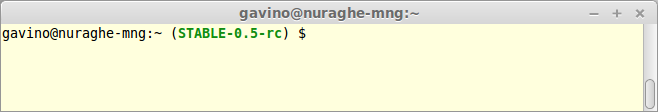
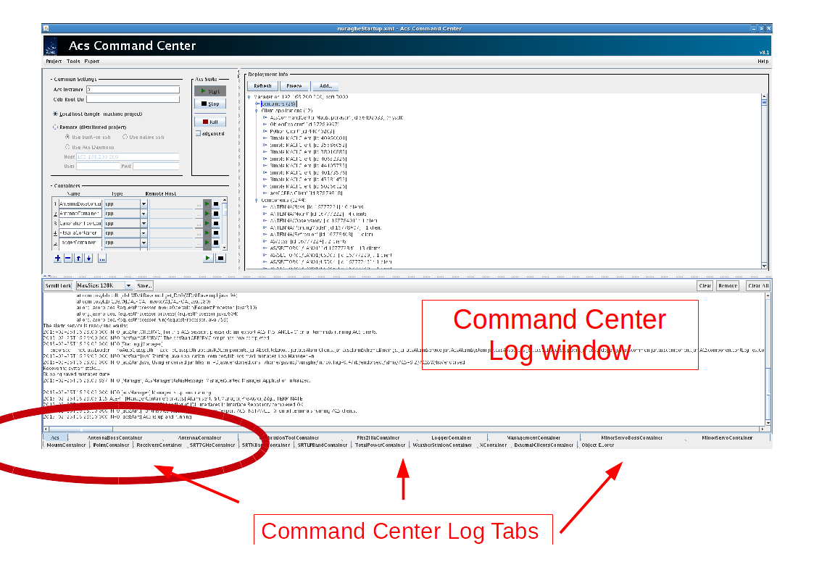
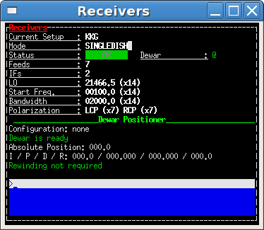

.. _nuraghe:

======================
NURAGHE
======================

****************
Avvio di Nuraghe
****************

.. index:: single: NURAGHE - Avvio

NURAGHE deve essere avviato dalla console *nuraghe-mng*  (username gavino)

Questa console ha 4 desktops virtuali che hanno le seguenti funzioni:

- **MNG** :math:`\rightarrow`  per eseguire ACS Command Center e gli altri tool ACS
- **CONSOLE** :math:`\rightarrow`  per le finestre della console 
- **AS**  :math:`\rightarrow` per connettersi al server della superficie attiva
- **MISC** :math:`\rightarrow` per varie azioni, come ad esempio l'avvio del *LocalOscillatorsContainer*

- Nel desktop virtuale **MNG** digitare in una shell di terminale::

    $> nuragheStable

  il prompt deve apparire come nella figura qua sotto:
  

   

- nella medesima shell digitare::

   $> nuraghe -start

- Apparirà ACS Command Center. Selezionare **localhost(single-machine project)**

Avvio di ACS
--------------------

- Avviare ACS  cliccando il pulsante ``start`` nel riquadro **ACS suite**
- Cliccare sul  *log tab* ``ACS`` in modo da selezionarlo:
            

- attendere che nel log tab ACS appaia **ACS is up and running**
  E' necessario, indicativamente, circa un minuto affinché ACS sia *up and running*.

Avvio dei *containers*
----------------------------

.. index:: single: NURAGHE - Avvio container

- individuare il riquadro **Containers**: contiene la lista dei container necessari, tranne che per il *LocalOscillatorsContainer*
  che necessita di una procedura di avvio separata

- Per ciascuno dei container, cliccare sul triangolo verde (è simile al simbolo tasto play di un lettore di musicassette)
- Con l'avvio del container, viene aperta la log tab con il nome del container, oppure nel caso in cui tale log tab  fosse
  già aperta, viene messa in evidenza.
- Avviare i container Local Oscillators e quelli della superficie attiva secondo le procedure sotto elencate.
- Verificare che tutti i container siano attivi, controllando :ref:`l'elenco dei container <nuraghe-is-ready>`

.. note::
  
   la finestra **please wait** può essere chiusa senza attendere se il
   container appare nella apposita lista della finestra *Deployment info*, **oppure** 
   se nel log tab del container appare il messaggio ``ContainerStatusMsg: Ready``
  
Container "Local Oscillators"
+++++++++++++++++++++++++++++++++++

.. index:: single: NURAGHE - Avvio  container Local Oscillators

- aprire un terminale vuoto nel desktop virtuale **MISC** digitare ::

   $ lo-ssh

- dopo il login, avviare il container con::
   
   $ acsStartContainer -cpp LocalOscillatorsContainer &

Superficie attiva
+++++++++++++++++++++++++++++

La superficie attiva è gestita dal server *nuraghe-as*, accessibile dal desktop virtuale **AS** su nuraghe-mng dove
sono aperte **due shell**  dalle quali effettuare una connessione *ssh*. Selezionare il desktop virtuale **AS** e 
verificare che siano già aperte due *shell* su ``gavino@nuraghe-as``. Una shell aperta su gavino@nuraghe-as appare  come nella figura:

.. figure: images/nuraghe_as_prompt.png
   :align: center
   :scale: 70 %
   :alt: prompt Nuraghe AS

Nel caso in cui le due shell non fossero già aperte,aprire due terminali in entrambi digitare il comando::

  $> as-ssh

Tale comando effettua una connessione ssh verso ``nuraghe-as``. 
Quindi su una shell digitare i comandi::

  $> nuragheStable
  $> asContainers

Nell'altra shell digitare il comando::

  $> nuragheStable
  $> SRTActiveSurfaceGUIClient &

La procudura è completata quando nellla prima shell appaiono i messaggi ``sectorX done`` dove ``x`` indica il numero del settore
della superficie attiva. Pertanto appariranno 8 messaggi, con x da uno a 8 (N.B potrebbero non essere in sequenza.

Console di NURAGHE 
+++++++++++++++++++++++++++++++++++++++++++++++

.. index:: single: NURAGHE - Avvio  console

Dal desktop virtuale ``CONSOLE`` di  ``nuraghe-obs1`` aprire una shell ed eseguire il comando::

  $> nuragheConsole

*******************
Shutdown di NURAGHE 
*******************

.. index:: single: NURAGHE - Shutdown

- Innanzitutto chiudere la console di nuraghe. Aprire un terminale dal desktop virtuale ``CONSOLE`` di ``nuraghe-obs1`` ::

  $> nuragheConsole --stop

- Dal desktop virtuale ``AS`` di ``nuraghe-mng`` chiudere l'interfaccia grafica della superficie attiva cliccando sul pulsante ``Quit``

- Su ACS Command Center  nel desktop virtuale ``MANAGER`` chiudere i *containers* cliccando il pulsante di chiusura collettiva
  (pulsante con quadrato nero posizionato sotto la lista dei container). In alternativa è possibile chiudere singolarmente ogni container

- Chiudere il container degli oscillatori locali:

  #. selezionare la shell *nuraghe-lo* sul desktop virtuale ``MISC`` di ``nuraghe-mng``
  #. premere il tasto ``enter`` per verificare di avere il controllo del prompt
  #. nel caso in cui non si abbia il controllo del prompt, premere ``ctrl-c``
  #. eseguire il comando::

     $ acsStopContainer LocalOscillatorsContainer

- Chiudere i container relativi alla superficie attiva:
  
  #. selezionare una shell di *nuraghe-as* sul desktop virtuale ``AS`` di nuraghe-mng
  #. premere il tasto ``enter`` per verificare di avere il controllo del prompt
  #. nel caso in cui non si abbia il controllo del prompt, premere ``ctrl-c``
  #. eseguire il comando::

     $ ~/SRTStopActiveSurfaceContainer.sh

- Su ACS Command Center, chiudere l' ``ACS Suite`` premendo il pulsante ``stop`` nell'omonimo riquadro.

.. note:: 

   In certi casi il processo di chiusura di *ACS* può lasciare attivo qualche processo precludendo 
   la chiusura pulita di tutto il sistema. In tal caso eseguire il comando **killACS** e attendere
   il messaggio *Removing ACS_INSTANCE temporary directories ... done*   

***************************************************
Riavvio container  Backends, FitsZilla o Management
***************************************************
.. index:: single: NURAGHE - Avvio  container Local Oscillators

I container dei Backends (i.e. TotalPowerContainer, XContainer e RoachContainer), il ManagementContainer e il FitsZillaContainer sono profondamente collegati tra loro. 
Pertanto, se uno di essi deve essere riavviato anche gli altri lo devono essere.

 #. Prendere nota dei messaggi di errore da ``jlog``
 #. Chiudere ogni console (nuragheConsole -stop su nuraghe-obs1 o nuraghe-mng a seconda del server sul quale è aperta)
 #. Chiudere  ``FitsZillaContainer``
 #. Chiudere  ``TotalPowerContainer``,  ``XContainer`` e ``RoachContainer``
 #. Chiudere  ``ManagementContainer``
 #. Riavviare  ``FitsZillaContainer``
 #. Riavviare  ``ManagementContainer``
 #. Riavviare ``TotalPowerContainer``,  ``XContainer`` e ``RoachContainer`` 
 #. Riavviare la console

Chiusura container ricevitori
************************************************************

Se durante le osservazioni è necessario chiudere uno dei container dei ricevitori è importante assicurarsi che non si chiuda il ricevitore in uso.
Pertanto verificare nella console di nuraghe il ricevitore in uso, che nell'esempio nella figura sotto è il ricevitore CCB.

Eventualmente, se la strategia osservativa lo consente, cambiare il riceivitore in uso.
Se ad esempio si vuole arrestare il container del ricevitore CCB e questo è in uso, cambiarlo con il comando:: 

   >receiversSetup=KKG

