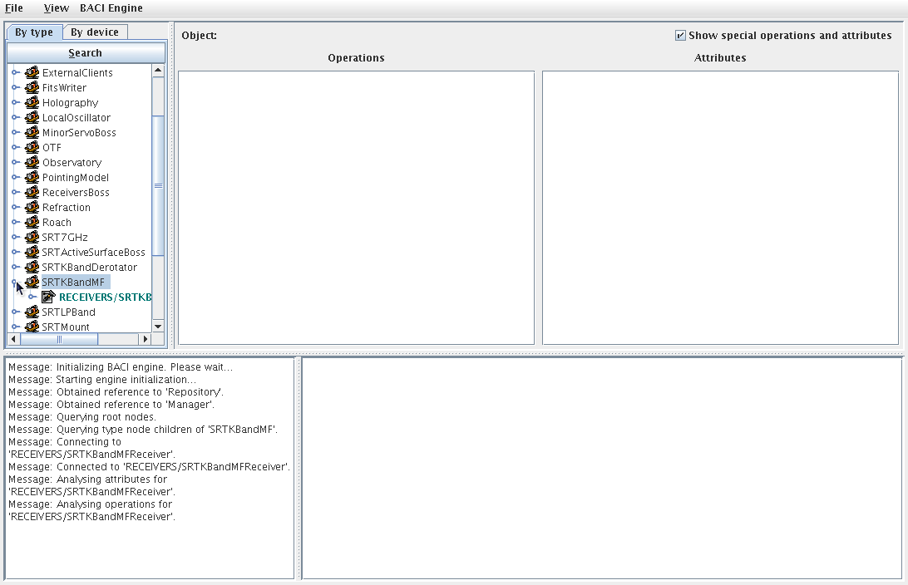
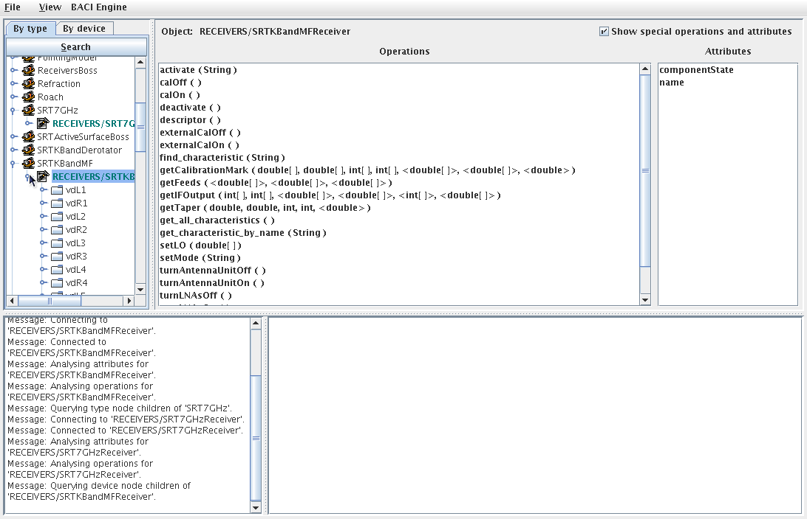

.. _objexp:

Object Explorer
---------------

.. index:: Object Explorer

Object explorer è un client dei component di Nuraghe che può essere utilizzato per diagnostica
o per eseguire operazioni avanzate. 

Da una shell di nuraghe-mng eseguire il comando::

$> objexp &

.. figure:: images/objexp_generic.png
   :scale: 100 %
   :alt:  object Explorer
   :align: center

Selezionare il component desiderato:

Se la selezione è andata a buon fine, nella finestra 'operations' appare l'elenco delle funzioni del component.

Per operare sulle properties, selezionare il simbolo di 'espansione elenco' a sinistra del
nome del component.

Scorrere l'elenco delle properties e selezionare. Per ottenere il valore della 'property'
