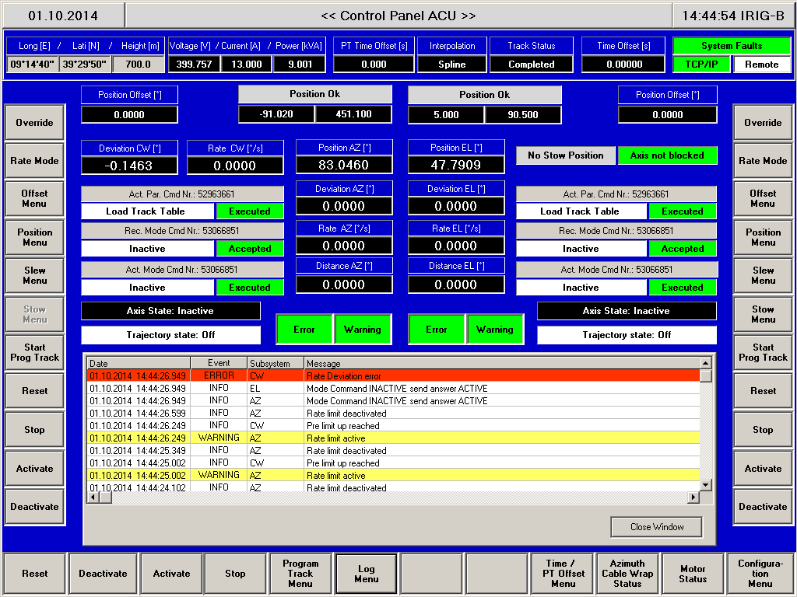
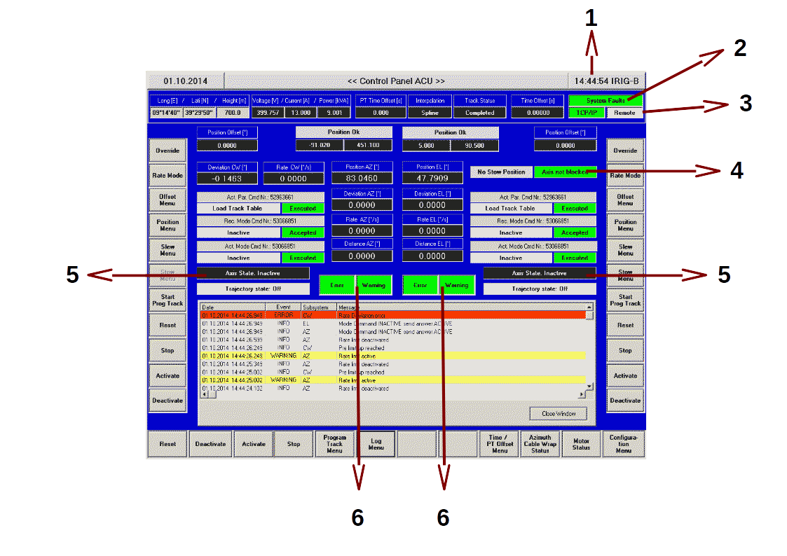

.. _pcp:

Pannello di controllo PCP
-------------------------

Il pannnello di controllo del PCP e' aperto sulla postazione ``ACU-PCP``

   Pannello di Controllo PCP.

   Descrizione del pannello di Controllo PCP.

Nel pannello è importante tenere sotto controllo le seguenti informazioni:

#. Ora e presenza segnale IRIG-B.
#. System fault. In caso di ``system fault`` riquadro diventa rosso. Gli emergency stop sono catalogati tra i *system fault*.
   Spostare i mouse sul riquadro per vedere quale è il problema
#. Modalità di funzionamento ACU: viene indicato  **remote** se è stato selezionata la modalità controllo :ref:`remoto dell'ACU <antenna>`
   oppure *LCP* se è attiva la modalità   :ref:`locale dell'ACU <antenna>`
#. Stato dell'asse di elevazione:
   
   - sfondo **verde** e testo **axis not blocked**: lo stow pin  non è inserito e pertanto l'antenna può essere mossa in elevazione.
   - sfondo **rosso**  e testo **axis blocked**: lo stow pin è inserito, l'asse è bloccato e non è consentito i movimento in elevazione.
     **l'antenna è in sicurezza**
#. stato degli assi: *active* o *inactive*. La movimentazione è possibile se gli assi sono attivati.
#. riquadri *error* e *warning*, a sinistra quelli relativi all'asse di azimuth, a destra quelli per l'asse di elevazione. 
   Se sono verdi, l'antenna è operativa. Se i *warning* diventano gialli, vuol dire che c'è un'informazione utile ma che non pregiudica
   il funzionamento del telescopio. Ad esempio sono  *warning* il raggiungimento delle posizioni di pre-limit.
   Se uno o entrambi i riquadri *error* sono rossi, è intervenuto un problema che ha bloccato il movimento del telescopio.
   Con il mouse, posizionarsi sul riquadro per leggere il tipo di errore intervenuto.
