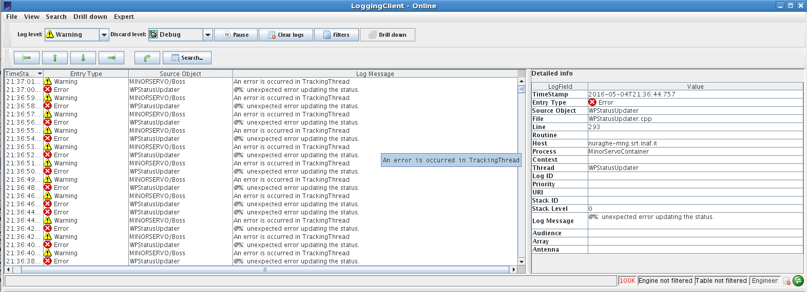

************
Servo minori
************

.. _ms-setup-problem:

Risolvere un setup non riuscito
===============================

.. index:: minor servo, servoSetup
   unknown, emergency stop, failure, reset, GFR, M3R, SRP, PFP, MSCU

Problema
--------
Dalla console *operatorInput* è stato eseguito il setup (comando ``setupXXX`` 
oppure ``servoSetup=XXX``) ma dopo qualche minuto nella console *MinorServo* 
il flag ``starting`` è passato da verde a rosso ed il flag ``ready`` è anche 
lui rosso.

Soluzione
---------
Controllare il *jlog*. Dovrebbero comparire uno o più messaggi di log relativi ai
servo minori. Si proceda nel seguente modo, a seconda del messaggio di log:

* se il messaggio di log indica "**GFR (o SRP o M3R o PFP) in failure**", molto
  probabilmente c'è un problema non risolvibile dal SD, e la cosa va
  semplicemente segnalata per email a tutti i SD. Prima di far ciò, si potrebbe
  provare a riavviare la MSCU, come indicato in :ref:`mscu-restart`;
* se è riportato "**GFR (o SRP o M3R o PFP) in emergency stop**", si vada alla
  sezione :ref:`ms-emergency-stop`;
* se è riportato un messaggio diverso dai precedenti, si vada alla sezione
  :ref:`mscu-restart`.

Flag di tracking rosso nella console, con messaggi di errore nel jlog
=====================================================================

Problema
--------
Durante l'osservazione, nella console dei servo minori, su *nuraghe-obs1*, il
flag di tracking diventa rosso,
e nella finestra del jlog (*nuraghe-mng*) compaiono diversi messaggi di errore,
aventi per *Source Object* ``MinorServoBoss`` o ``WPStatusUpdater``, come
riportato nella seguente figura.

   Figura: Il Jlog riporta degli errori che hanno come *Source Object*
   ``MinorServoBoss`` o ``WPStatusUpdater``.

Soluzione
---------
Si riavvii la MSCU, come descritto nella sezione :ref:`mscu-restart`.

Problemi di puntamento
======================

.. index:: minor servo, SRP, MSCU

Problema
--------
La sorgente non viene puntata o l'errore di puntamento è molto alto. 

Soluzione
---------
Possibilita':

* container servo giù
* Superficie attiva non configurata 
* failure SRP
* messaggio errore differente da failure, in questo caso :ref:`mscu-restart`
