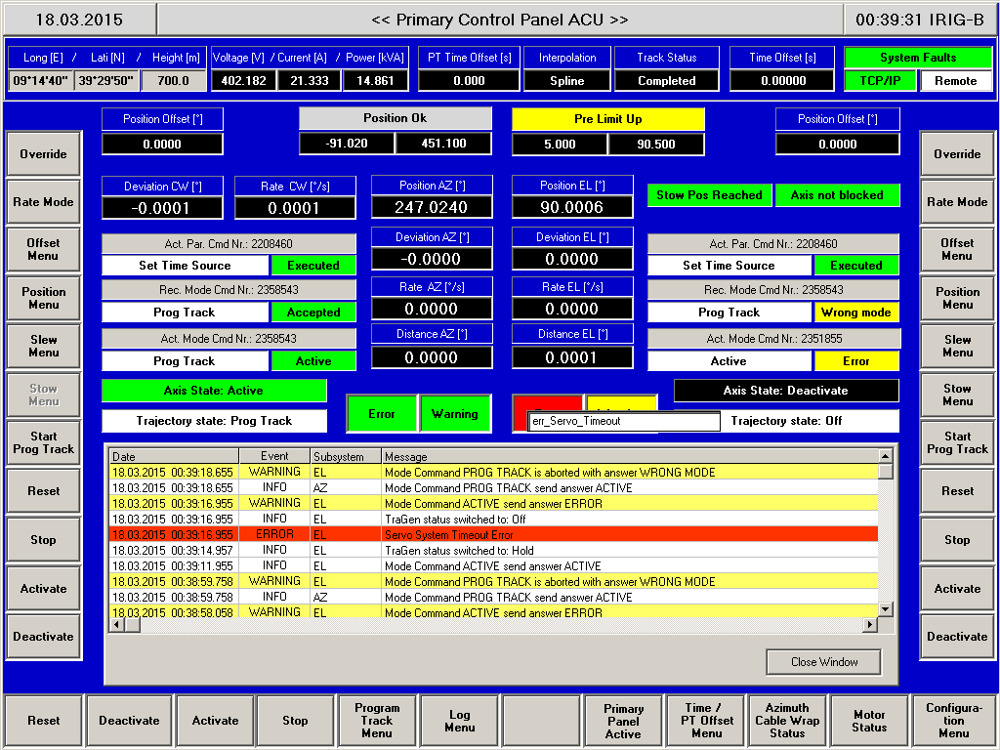

================================
Servo Sistemi Maggiori (Antenna)
================================
 
Il corretto funzionamento dei servo sistemi maggiori viene controllato tramite la console  ACU-PCP.

Servo timeout error
*******************

.. index:: pair: Servo Sistemi Maggiori; Timeout error 

Come riconoscere il problema
----------------------------

Di solito si può manifestare dopo una procedura di ``unstow``, all'atto di attivare gli assi.
Nel pannello di controlo del :ref:`PCP <pcp>`  uno dei riquadri ``error`` diventa rosso e l'asse corrispondente non viene attivato

Soluzione
---------

#. effettuare l'acknowledge dell'errore tramite comando  ``antennaReset`` nella console di NURAGHE
#. rimettere l'antenna in modalità track tramite comando ``antennaTrack`` nella console di NURAGHE
#. se il problema non si risolve, ripetere i punti 1 e 2 fino ad un massimo di 4 o cinque volte.
#. se il problema continua a persistere occore recarsi nella stanza ALER e :

   - aprire pannello di controllo LCP   se non aperto
   - premere pulsante ``main drive on/off`` nel ECP  per spegnere il software di controllo dell'ACU
   - attendere circa 60 secondi.
   - premere nuovamente il pulsante ``main drive on/off`` per riaccendere il software di controllo dell'ACU
   - rientrare in BOX CR
   - eseguire il comando ``antennaTrack`` dalla console di NURAGHE al fine di rimetter l'antenna in modalità track.

Servo Power Error
*****************

.. index:: pair: Servo Sistemi Maggiori; Timeout error 
   
Indica un problema nella fornitura di corrente all'ACU (errore nella fase o valori di tensione oltre l'intervallo operativo)

Come riconoscere il problema
----------------------------
 
Nel pannello di controllo :ref:`PCP <pcp>`  i riquadri *error* sono in condizione di errore (colore rosso) e
indicano l'errore **err_Power_Error**. Inoltre, in :ref:`jlog <jlog>` appare il messaggio di errore **MAIN POWER ERROR**, con livello 
di priorita **CRITICAL**

L'errore è individuabile anche tramite jlog, in quanto viene segnalato con  priorità CRITICAL, con messaggio "MAIN POWER ERROR".  

Soluzione
---------
 
Dalla console di NURAGHE, eseguire i seguenti comandi::

> antennaReset
> antennaTrack

